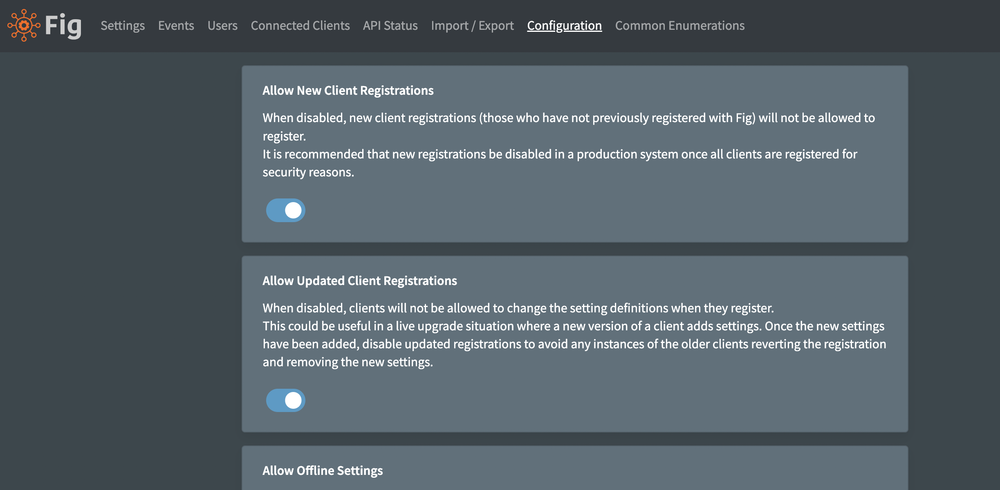

# Configuration

There are a few parameters which can be configured for Fig which enable or disable certain features in the application.

## Configuration Options

### Allow New Client Registrations

When disabled, new client registrations (those who have not previously registered with Fig) will not be allowed to register.

It is recommended that new registrations be disabled in a production system once all clients are registered for security reasons.

### Allow Updated Client Registrations

When disabled, clients will not be allowed to change the setting definitions when they register.

This could be useful in a live upgrade situation where a new version of a client adds settings. Once the new settings have been added, disable updated registrations to avoid any instances of the older clients reverting the registration and removing the new settings.

### Allow Offline Settings

Fig clients can save the settings values locally in a file so they client can still start even if the Fig API is down.

Settings are encrypted using the client secret and stored in a binary file. However, it may still be desirable to disable this feature if additional security is more important than up time.

### Allow File Imports

Fig supports loading export from an import directory. This is a useful feature when Fig is deployed in a container as a Helm chart or similar can be used to set the initial configuration.

However, depending on the level of access to the import directory, it may impose a security risk as imports can be configured to remove existing clients and settings.

### Allow Client Overrides

Client overrides allow applications to override the setting value for settings based on an environment variable.

This can be useful for container deployments where you want to set container deployment specific values but still see an manage the settings in Fig.

Note that any settings changes will be reverted on the next client restart back to the environment variable value.

### Client Override Regex

If client overrides are enabled, only clients with names matching this regular expression will be allowed to override settings.

### Memory Leak Analysis

Fig can analyze memory leaks in running clients. A memory leak is suspected if the memory usage reported by the client has a positive trend-line and the average of the final values is more than 1 standard deviation higher than the average of the first values.

Fig will discard the first few memory values as the application is ramping up. The period between checks can also be adjusted.

### Web Application Base Address

This is the address that users use to access the web application. It is used to generate links for web hooks.

## Appearance

