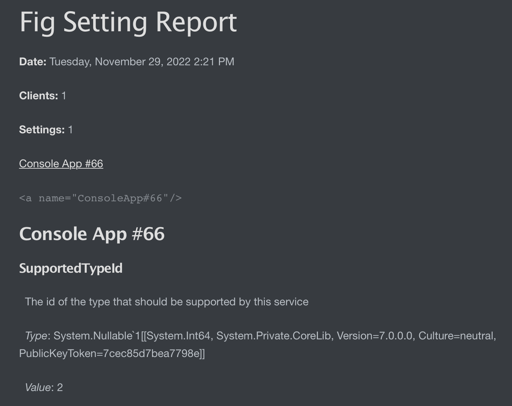

# Import / Export

Fig supports a number of different types of import and export.

| Type                    | Imported Supported | Export Supported |
| ----------------------- | ------------------ | ---------------- |
| Full Client Information | Yes                | Yes              |
| Value Only              | Yes                | Yes              |
| Markdown Format         | No                 | Yes              |

## Full Client Information

It is possible to import and export all client information from Fig. This allows the full configuration of Fig to be exported from one instance and imported into another. It can also be used for backup purposes.

### Export

When exporting, it is possible to export secret settings in an encrypted format or in plain text. If they are exported encrypted, the server secret must be the same where they are imported or that Fig instance will not be able to decrypt the values.

Exports are in a JSON format and can be performed from the Fig Web Application

An example export might look like the following:

```json
{
   "ExportedAt":"2022-11-29T14:04:03.434767Z",
   "ImportType":2,
   "Version":1,
   "Clients":[
      {
         "Name":"Console App #66",
         "ClientSecret":"$2a$11$CeB49SBvaIEBNWOy19kR7eo878DNGO7bQg0o5J8YQLgUP/favAMfa",
         "Instance":null,
         "Settings":[
            {
               "Name":"SupportedTypeId",
               "Description":"The id of the type that should be supported by this service",
               "IsSecret":false,
               "ValueType":"System.Nullable`1[[System.Int64, System.Private.CoreLib, Version=7.0.0.0, Culture=neutral, PublicKeyToken=7cec85d7bea7798e]], System.Private.CoreLib, Version=7.0.0.0, Culture=neutral, PublicKeyToken=7cec85d7bea7798e",
               "Value":{
                  "type":"System.Int64, System.Private.CoreLib, Version=7.0.0.0, Culture=neutral, PublicKeyToken=7cec85d7bea7798e",
                  "value":2
               },
               "DefaultValue":null,
               "IsEncrypted":false,
               "JsonSchema":null,
               "ValidationType":"None",
               "ValidationRegex":null,
               "ValidationExplanation":null,
               "ValidValues":null,
               "Group":null,
               "DisplayOrder":1,
               "Advanced":false,
               "LookupTableKey":"Types",
               "EditorLineCount":null,
               "DataGridDefinitionJson":null,
               "EnablesSettings":null,
               "SupportsLiveUpdate":true
            }
         ],
         "Verifications":[
         ]
      }
   ]
}
```

Setting exports can be modified before they are imported but they will be overwritten the first time the client registers if they values are different.

### Import

Full exports can be imported via the Fig web application or via file loading. 

There are 3 Options for importing

- Add new - only add setting clients that are new and leave the others unchanged.
- Replace Existing - import all settings clients in the import and replace any existing clients.
- Clear and Import - clear the database and load in the clients from the settings file


It is also possible to import settings by moving a file into a watched folder by fig. See below for details.


## Value Only

It is possible to export and import only the setting values for the settings. This is convenient when you just want to override a few default values and do not want to have to manage the full JSON structure.

Value only export look something like this:

```json
{
   "ExportedAt":"2022-11-29T14:15:16.250447Z",
   "ImportType":3,
   "Version":1,
   "Clients":[
      {
         "Name":"Console App #66",
         "Instance":null,
         "Settings":[
            {
               "Name":"SupportedTypeId",
               "Value":{
                  "type":"System.Int64, System.Private.CoreLib, Version=7.0.0.0, Culture=neutral, PublicKeyToken=7cec85d7bea7798e",
                  "value":2
               }
            }
         ]
      }
   ]
}
```


It is possible to import value only settings even when a client hasn't yet registered. In this case, Fig stores these settings in a staging area waiting for the client to register. Once the registration takes place, the updated values are applied directly.

In this case, they will be noted as such in the Fig Web Application.


It is also possible to import value only files using the folder based import.


## Markdown

It is possible to export the settings in a markdown format. This can be useful for reporting purposes and to easily capture the current 'state' of an installation. Markdown exports cannot be imported.



## Folder Based Import

Settings can be automatically imported by placing them in a directory on the server or container where Fig.API is running.

The folder path is:

Application Data / Fig / Config Import