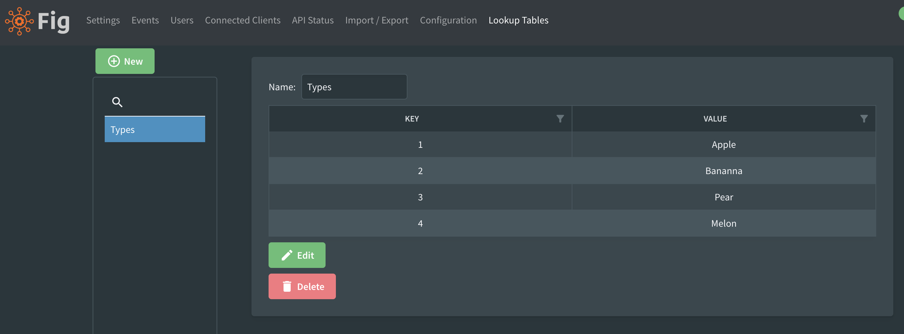
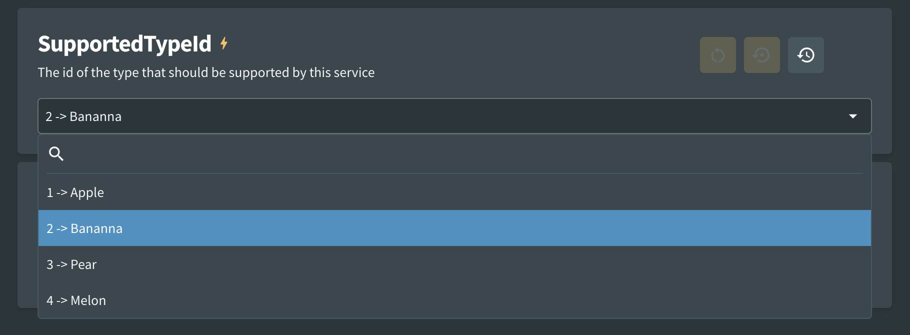

# Lookup Tables

Fig supports the concept of lookup tables. This is where a set of setting values supplied by a client can be translated into more user friendly values.

One example of where this might be useful is where an integration needs access to specific database ids in order to communicate with with other services. These database ids are not very user friendly and may change from deployment to deployment. In this case a lookup integration can be written to populate a lookup table with user friendly values that assist the person configuring the service.

The lookup table name must be defined in the setting.

```csharp
[Setting("The id of the type that should be supported by this service")]
[LookupTable("Types")]
[DisplayOrder(1)]
public long? SupportedTypeId { get; set; }
```

 If there is no lookup table defined, the setting will be editable as an long.


A lookup table can be defined within the Fig web application. For example:



:::tip

When editing the lookup tables use a comma to separate the key and value and a new line to separate each row.

:::

Once the lookup table has been defined, the setting will appear as a dropdown option with the valid values displayed.

You will need to reload the page for this change to take effect.



When the setting is requested by the client, it will be returned with the original type (a nullable long in this case)


## Lookup Table API

See [Lookup Table Integration](../integration-points/lookup-table-integration.md) for details.

