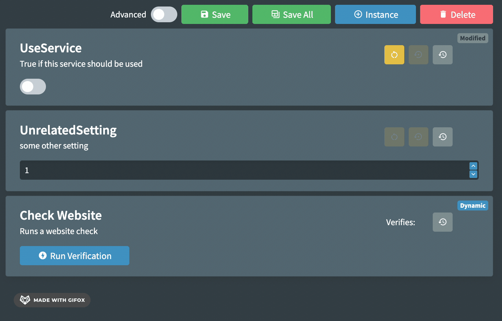

# Dependent Settings

Sometimes there are settings that enable other settings. For example an application might be able to work both with and without authentiation. If authentication is selected then a username and password must be supplied. In this case, we can add an attribute to the authentication switch to hide the irrelevent settings when disabled.

Note that it suggested that you use the `DisplayOrder` attribute in conjunction with these settings to ensure they are ordered correctly.

## Usage

```c#
[Setting("True authentication should be used.", false)]
[EnablesSettings(nameof(ServiceUsername), nameof(ServicePassword))]
public bool Authenticate { get; set; }

[Setting("The username when logging into the service.")]
public string? ServiceUsername { get; set; }

[Setting("The password corresponding to the supplied username."")]
[Secret]
public string? ServicePassword { get; set; }
```

## Appearance

## 