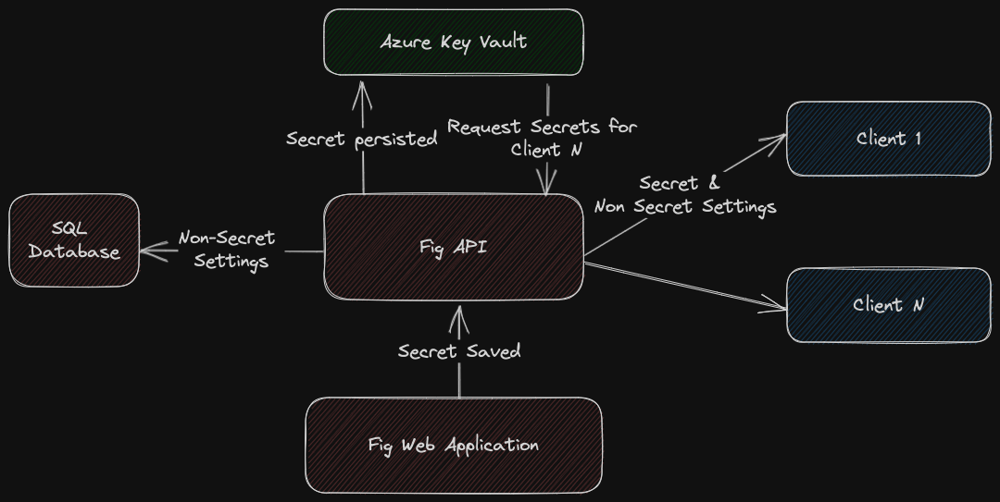

# Possible Azure Key Vault Integration

Fig can handle secret values with all setting values being stored encrypted in an enterprise database. However for some high securiy deployments it may be desirable to store secret values in a dedicated secret store such as Azure Key Vault. This page lays out two possible integration options.

## Option 1 - Key Vault Integrated to Fig API

In this option users would set secrets in the Fig web application and these will be sent to the API. However, instead of being persisted in the SQL database, they would be sent to the Azure Key Vault. If the keys didn't exist, the API would create them. If they did exist, they would be updated.
When a client requests their settings, any secrets would be retrieved from Azure Key Vault before being returned to the client.

Pros
- There would be no difference to users or clients when an Azure Key Vault integration was active
- Fig would handle key creation & update so less configuration required
- Fig could log when changes are made to those values and which users made the changes. This would make all audit changes in a single location (unless the keys were updated outside of Fig)
- Fig could alert clients when secret values had been changed allowing for live update

Cons
- The identity of the machine running Fig would have full access to all secrets managed by Fig.
- Fig would be handling the secrets (although not persisting them)

## Option 2 - Key Vault accessed directly by clients

In this option, the management of Azure Key Vault would be done outside Fig. Fig would show that the setting existed but it would be read only and only contain a link to the Key Vault. When clients requested settings, they would get all settings from Fig except the secret settings. They would then make a separate request to the secret store for those settings.

Pros
- More secure as each application could be configured to only have access to their settings in Key Vault. Fig would have no access to the Key Vault.
- Fig would not handle the secrets at all apart from the client integration.

Cons
- Adding & updating keys would have to be done manually or by some automation scripts outside of Fig
- Users could not update all settings in the same place
- Fig would not be able to log secret changes (they are presumably logged in Key Vault)
- Fig would not be able to alert applications when secrets have changed (unless Key Vault can do this)

